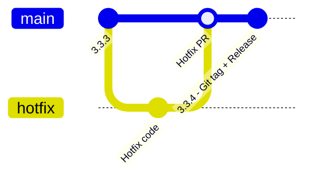
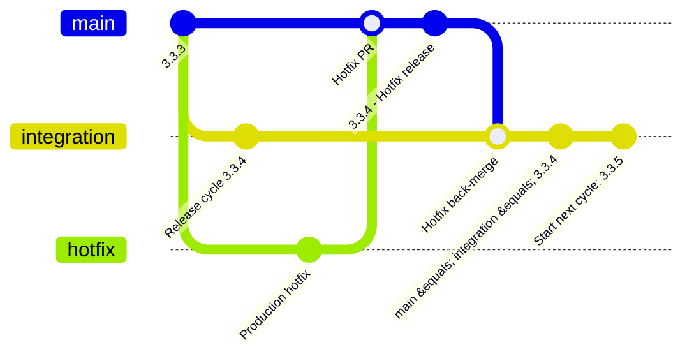

# CI/CD

- Patch  reserve for  hotfix 
- Minor/Major reserve for normal release, normal branch: default minor
- Auto pr from hotfix to intg 
- Specfic tag from manual dev img build from specific branch: dev-..-branch_name push to DEV harbor


## Workflows

| Workflow | Trigger | Purpose |
|---|---|---|
| **00 - List Available DEV/RC/PROD Builds** | Manual | List available DEV, RC and PROD builds |
| **01 - CI** | Auto | CI checks, version handling, Git tag/release creation |
| **02 - Build images** | Auto | Build application images |
| **02b - Build Poetry Base Image** | Auto | Build Poetry base image |
| **03 - Prepare Release** | Manual | Prepare RC images and create release PR |
| **04 - Release images to PROD** | Manual | Release/promote images to PROD |

> **Note:** Each workflow supports manual triggering (`workflow_dispatch`).  
> The **Auto** and **Manual** labels above describe the normal release-cycle usage.

---

## Version Management

The version is determined from the **PR label**.

### Version Priority

```text
major > minor > patch
```

### Version Calculation

```text
If no active release cycle:
    Start new cycle with calculated version.

If active release cycle exists:
    Compare active cycle version vs incoming version.

    If incoming version has higher priority:
        Upgrade active cycle version.

    Else:
        Keep active cycle version.
```

### Example

```text
Current release cycle = patch 3.3.4
Incoming PR           = minor 3.4.0

Result:
3.3.4 → 3.4.0
```

---

# Release Cycle Detection

## No Active Release Cycle

```text
main        = 3.3.2
integration = 3.3.2
```

Meaning:

```text
No active release cycle
```

CI detects:

```text
main version == integration version
        │
        ▼
Start new release cycle
        │
        ▼
Apply version bump
        │
        ▼
integration = 3.3.3
```

## Active Release Cycle

After the first PR starts the release cycle:

```text
main        = 3.3.2
integration = 3.3.3
```

Meaning:

```text
Active release cycle = 3.3.3
```

CI detects:

```text
main version != integration version
        │
        ▼
Active release cycle already exists
        │
        ▼
No version bump for the release cycle
```

---

# NORMAL RELEASE

## Git Graph


## Flow

```text
START
  │
  ▼
work1, work2, work3
  │
  │ PR to integration
  │
  │ Default PR label: patch
  │
  ▼
01 CI
  │
  └── Auto trigger
      └── Only check code
  │
  ▼
==================== INTEGRATION BRANCH ====================
  │
  │ PR merged to integration
  ▼
01 CI
  │
  ├── Detect release cycle
  ├── Bump version
  └── Update version files
  │
  ▼
01 done
  │
  ▼
02 Build images
  │
  ├── Auto trigger
  ├── Build image
  ├── Tag image:
  │     ├── dev
  │     ├── dev + intg 
  │     
  │
  └── Push to Harbor DEV repository
  │
  ├─────────────────────────────────────┐
  │                                     │
  ▼                                     ▼
02b Build Poetry Base Image        02 Build images
  │                                     │
  │        Parallel run                 │
  └──────────────────┬──────────────────┘
                     │
                     ▼
              02, 02b done
                     │
                     ▼
              03 Prepare Release
                     │
                     ├── Auto trigger
                     ├── Retag images as RC
                     │     Example:
                     │     3.3.3.rcN
                     │
                     ├── Push RC images
                     │     to Harbor UAT repository
                     │
                     ├── Create PR automatically
                     │     → main
                     │
                     └── Manual input:
                           PR description
                           for changelog generation
                     │
                     ▼
======================== MAIN BRANCH ========================
                     │
                     │ PR merged to main
                     ▼
                    01 CI
                     │
                     ├── Auto trigger
                     ├── Create Git tag
                     ├── Create GitHub Release
                     └── Update changelog
                     │
                     ▼
                  03 done
                     │
                     ▼
              04 Release images to PROD
                     │
                     ├── Manual trigger
                     ├── Retag images to release version:
                     │     ├── 3.3.3
                     │     ├── 3.3.3-sha
                     │     └── 3.3.3-sha-date
                     │
                     └── Push to Harbor UAT/PROD repository
                     │
                     ▼
               FINISH RELEASE CYCLE
```

---

# HOT FIX / QUICK RELEASE

## Git Graph



## Flow

```text
START
  │
  ▼
HOTFIX BRANCH
  │
  ├── Fix code
  │
  ▼
PR to main
  │
  ▼
01 CI
  │
  └── Auto trigger
      └── Only check code
  │
  ▼
PR merged to main
  │
  ▼
======================== MAIN BRANCH ========================
  │
  ▼
01 CI
  │
  ├── Auto trigger
  ├── Bump version for hotfix
  │     └── Patch
  ├── Update version files
  ├── Create Git tag
  └── Create GitHub Release
  │
  ▼
01 done
  │
  ▼
02 Build images
  │
  ├── Manual trigger
  ├── Input tag
  └── Build image from that Hotfix tag
  │
  ▼
02 done
  │
  ▼
04 Release images to PROD
  │
  ├── Manual trigger
  ├── Retag image to release version:
  │     ├── 3.3.3
  │     ├── 3.3.3-sha
  │     └── 3.3.3-sha-date
  │
  └── Push to Harbor UAT/PROD repository
  │
  ▼
FINISH HOTFIX RELEASE
```

---

# Scenario: Hotfix During Active Patch Release

## Current State

```text
main        = 3.3.3
integration = 3.3.4
```

Therefore:

```text
Release cycle 3.3.4 is already active.
```

## Git Graph



## Flow

```text
                    ACTIVE RELEASE CYCLE
                    ====================

main        = 3.3.3
integration = 3.3.4
                 │
                 └── Active release = 3.3.4
                              │
                              │
                         Production
                           hotfix
                              │
                              ▼
                         HOTFIX BRANCH
                              │
                              ▼
                           PR → main
                              │
                              ▼
                       HOTFIX RELEASE
                              │
                              ▼
                         main = 3.3.4
                              │
                              │
                              │ hotfix back-merge
                              ▼
                     integration = 3.3.4
                              │
                              ▼
                  main == integration
                              │
                              ▼
                   Active cycle completed
                              │
                              ▼
                 Automatically start next
                     patch release cycle
                              │
                              ▼
                    integration = 3.3.5
```

## Result

Before hotfix:

```text
main        = 3.3.3
integration = 3.3.4
```

After hotfix and hotfix back-merge:

```text
main        = 3.3.4
integration = 3.3.4
```

To avoid image tag conflicts, the active release cycle is automatically moved to the next patch version:

```text
main        = 3.3.4
integration = 3.3.5
```

Therefore:

```text
3.3.4 = completed hotfix/release
3.3.5 = new active release cycle
```

---

# Overall Version / Branch State

```text
                    ┌──────────────────────────┐
                    │ main == integration      │
                    │        3.3.2             │
                    └────────────┬─────────────┘
                                 │
                                 │ CI detects
                                 │ no active cycle
                                 ▼
                    ┌──────────────────────────┐
                    │ Start release cycle      │
                    │ integration = 3.3.3      │
                    └────────────┬─────────────┘
                                 │
                                 ▼
                    ┌──────────────────────────┐
                    │ Active release cycle     │
                    │ main = 3.3.2             │
                    │ intg = 3.3.3              │
                    └────────────┬─────────────┘
                                 │
                     Incoming PR labels
                                 │
                ┌────────────────┼────────────────┐
                ▼                ▼                ▼
              patch            minor            major
                │                │                │
                ▼                ▼                ▼
             keep            upgrade            upgrade
             cycle          cycle version      cycle version
                │                │                │
                └────────────────┼────────────────┘
                                 │
                                 ▼
                           Release → main
                                 │
                                 ▼
                         main = integration
                                 │
                                 ▼
                         Cycle completed
```
