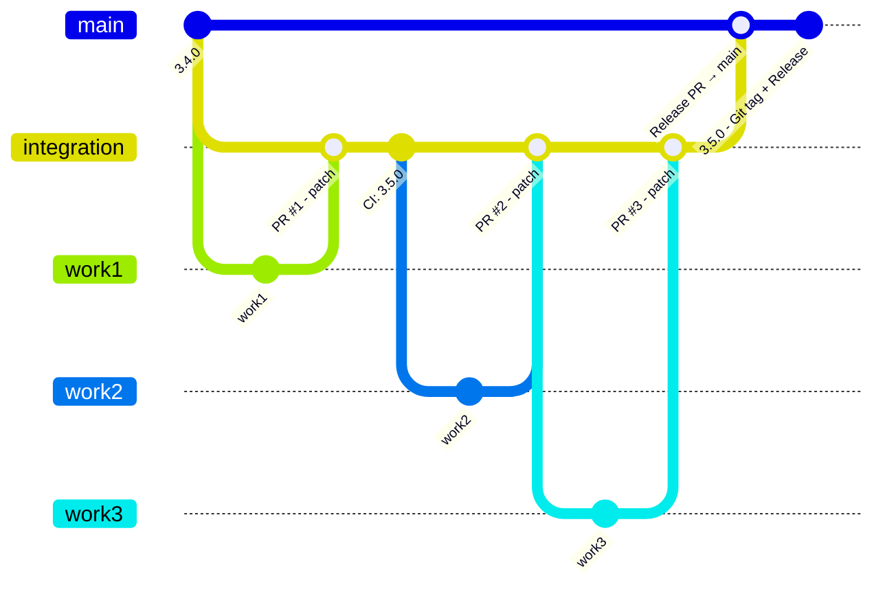
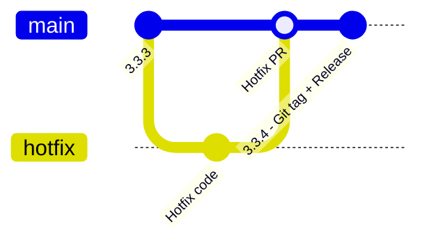

# CI/CD

- `patch` is reserved for hotfix releases.
- `minor`/`major` are reserved for normal releases on normal branches; default is `minor`.
- Automatically create a PR from the hotfix branch to `integration`.
- Manual DEV image build from a specific branch uses tag `dev-<branch_name>` and pushes to DEV Harbor.

## Workflows

| Workflow                                   | Trigger | Purpose                                               |
| ------------------------------------------ | ------- | ----------------------------------------------------- |
| **00 - List Available DEV/RC/PROD Builds** | Manual  | List available DEV, RC, and PROD builds               |
| **01 - CI**                                | Auto    | CI checks, version handling, Git tag/release creation |
| **02 - Build images**                      | Auto    | Build application images                              |
| **02b - Build Poetry Base Image**          | Auto    | Build Poetry base image                               |
| **03 - Prepare Release**                   | Manual  | Prepare RC images and create release PR               |
| **04 - Release images to PROD**            | Manual  | Release/promote images to PROD                        |

> **Note:** Each workflow supports manual triggering (`workflow_dispatch`).  
> The **Auto** and **Manual** labels above describe the normal release-cycle usage.

---

## Version Management

The version is determined by the **PR label**.

---

# Release Cycle Detection

## No Active Release Cycle

```text
main        = 3.4.0
integration = 3.4.0
```

Meaning:

```text
No active release cycle
```

CI detects:

```text
main version == integration version
        │
        ▼
Start new release cycle
        │
        ▼
Apply version bump
        │
        ▼
integration = 3.5.0
```

## Active Release Cycle

After the first PR starts the release cycle:

```text
main        = 3.4.0
integration = 3.5.0
```

Meaning:

```text
Active release cycle = 3.5.0
```

CI detects:

```text
main version != integration version
        │
        ▼
Active release cycle already exists
        │
        ▼
No version bump for the release cycle
```

---

# NORMAL RELEASE

## Git Graph



## Flow

```text
START
  │
  ▼
work1, work2, work3
  │
  │ PR to integration
  │
  │ Default PR label: Minor
  │
  ▼
01 CI
Auto trigger
  │
  └── Run code checks only
  │
  ▼
==================== INTEGRATION BRANCH ====================
  │
  │ PR merged to integration
  ▼
01 CI
Auto trigger
  │
  ├── Detect release cycle
  ├── Bump version
  └── Update version files
  │
  ▼
01 done
  │
  ▼
02 Build images
Auto trigger
  │
  ├── Build images
  ├── Tag image:
  │     ├── dev-sha
  │     ├── dev-branch
  │
  │
  └── Push to Harbor DEV repository
  │
  ├─────────────────────────────────────┐
  │                                     │
  ▼                                     ▼
02b Build Poetry Base Image        02 Build images
  │                                     │
  │        Parallel run                 │
  └──────────────────┬──────────────────┘
                     │
                     ▼
              02, 02b done
                     │
                     ▼
              03 Prepare Release
              Auto trigger
                     │
                     ├── Retag images as RC
                     │     Example:
                     │     3.5.0-rcN
                     │
                     ├── Push RC images
                     │     to Harbor UAT repository
                     │
                     ├── Create PR automatically
                     │     → main
                     │
                     └── Manual input:
                           PR description
                           for changelog generation
                     │
                     ▼
======================== MAIN BRANCH ========================
                     │
                     │ PR merged to main
                     ▼
                    01 CI
                    Auto trigger
                     │
                     ├── Create Git tag
                     ├── Create GitHub Release
                     └── Update changelog
                     │
                     ▼
                  03 done
                     │
                     ▼
              04 Release images to PROD
              Auto trigger
                     │
                     ├── Retag images to release version:
                     │     ├── 3.5.0
                     │     ├── 3.5.0-sha
                     │     └── 3.5.0-sha-date
                     │
                     └── Push to Harbor UAT/PROD repository
                     │
                     ▼
               FINISH RELEASE CYCLE
```

---

# HOTFIX / QUICK RELEASE

## Git Graph



## Flow

```text
START
  │
  ▼
HOTFIX BRANCH
  │
  ├── Fix code
  │
  ▼
PR to main
  │
  ▼
01 CI
Auto trigger
  │
  └── Run code checks only
  │
  ▼
PR merged to main
  │
  ▼
======================== MAIN BRANCH ========================
  │
  ▼
01 CI
Auto trigger
  │
  ├── Bump version for hotfix
  │     └── patch
  ├── Update version files
  ├── Create Git tag
  └── Create GitHub Release
  │
  ▼
01 done
  │
  ▼
02 Build images
Manual trigger
  │
  ├── Input tag
  └── Build image from that Hotfix tag
    ├── Tag image:
  │     ├── dev+branchname
  │
  ▼
02 done
  │
  ▼
04 Release images to PROD
Manual trigger
  │
  ├── Retag image to release version:
  │     ├── 3.3.3
  │     ├── 3.3.3-sha
  │     └── 3.3.3-sha-date
  │
  └── Push to Harbor UAT/PROD repository
  │
  ├── Auto pr to intg branch
  ▼
FINISH HOTFIX RELEASE
```

---
