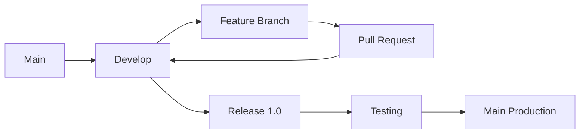

flowchart TD

    A[Developer creates feature branch from dev] --> B[Code locally]

    B --> C[Open PR to dev]

    C --> D[CI runs on PR]
    D --> D1[Lint]
    D --> D2[Test]
    D --> D3[Build]
    D --> D4[Security scan]

    D --> E{CI passed?}

    E -- No --> F[Fix code in feature branch]
    F --> D

    E -- Yes --> G[Merge into dev]

    G --> H[Build Docker image once]
    H --> I[Tag image with Git SHA]
    I --> J[Push image to registry]

    J --> K[Deploy latest dev to DEV environment]

    K --> L[Ready for integration testing?]

    L --> M[Create PR dev to integration]

    M --> N[CI runs again on integration]
    N --> O[Deploy to Integration/UAT environment]

    O --> P{QA approved?}

    P -- No --> Q[Fix in feature branch]
    Q --> C

    P -- Yes --> R[Create PR integration to main]

    R --> S[Final CI checks]

    S --> T[Release approval]

    T --> U[Tag official version v1.2.0]

    U --> V[Deploy same image to PROD]


    flowchart TD

    A[Developer creates feature branch from dev] --> B[Open PR to dev]

    B --> C["AUTOMATIC CI
    - lint
    - tests
    - build check
    - security scan"]

    C --> D{CI passed?}

    D -- No --> E[Developer fixes code]
    E --> C

    D -- Yes --> F["MANUAL
    Code review + approve"]

    F --> G["MANUAL
    Merge to dev"]

    G --> H["AUTOMATIC
    Build Docker image/package ONCE"]

    H --> I["AUTOMATIC
    Tag image with commit SHA
    example: abc123"]

    I --> J["AUTOMATIC
    Push image to registry"]

    J --> K["AUTOMATIC
    Deploy latest image to DEV"]

    K --> L["MANUAL
    Decide release candidate"]

    L --> M["MANUAL
    Promote same image to integration/staging"]

    M --> N["AUTOMATIC
    Retag image as RC
    example: 1.2.0-rc.1"]

    N --> O["AUTOMATIC
    Deploy RC to staging"]

    O --> P{QA passed?}

    P -- No --> Q[Fix bug and create new RC]
    Q --> B

    P -- Yes --> R["MANUAL
    Approve production release"]

    R --> S["MANUAL
    Merge integration to main"]

    S --> T["AUTOMATIC
    Retag SAME image as official version
    example: v1.2.0"]

    T --> U["AUTOMATIC
    Create GitHub Release + changelog"]

    U --> V["MANUAL
    Production deployment approval"]

    V --> W["AUTOMATIC
    Deploy SAME image to PROD"]


    Simple Mental Model
Branches
Branch	Purpose
dev	developers combine features
integration	QA/staging/testing
main	production
CI Behavior
During PR to dev

GitHub temporarily tests:

current dev + new feature

CI runs:

lint
tests
build validation
security scan

NO official image/version yet.

Build Stage
After merge to dev

We:

build Docker image/package ONCE
tag with unique SHA

Example:

myapp:abc123

This is the real reusable artifact.

Deployment Rules
DEV environment

Purpose:

fast developer integration

Best practice:

cancel-in-progress: true

Meaning:

newest deployment wins
old deployment jobs cancelled

Example:

aaa111 cancelled
bbb222 deployed

DEV always runs:

latest shared dev state
Important

Code is NOT replaced.

dev branch grows:

Feature A
+ Feature B
+ Feature C

New deploys include previous features.

STAGING / INTEGRATION

Purpose:

stable QA testing

Best practice:

cancel-in-progress: false

Meaning:

deployments queue
only one RC deployed at a time
Release Candidate (RC)

Example:

1.2.0-rc.1
1.2.0-rc.2
1.2.0-rc.3

If QA fails rc1:

create rc2
deploy rc2
rc2 replaces rc1 in staging

Registry stores all RCs, but staging usually runs only ONE active RC.

Production

Only approved RC becomes production version.

Example:

1.2.0-rc.3
↓
v1.2.0

Best practice:

manual approval
protected environment
queue deployments
rollback strategy
Most Important Senior DevOps Rule
Build once.
Promote same artifact everywhere.

Meaning:

DO NOT rebuild in staging
DO NOT rebuild in production

Reuse SAME image:

myapp:abc123

across:

DEV
STAGING
PROD
Automation vs Manual
AUTOMATIC 🤖
CI checks
build image
tag SHA
push registry
deploy DEV
create RC tags
create release tags
generate changelog
MANUAL 👨‍💻
code review
PR approval
choosing RC
QA approval
production approval
Final Best-Practice Rules
DEV
fast
latest wins
shared environment
STAGING
stable
QA-safe
one RC at a time
PROD
controlled
auditable
safe


You are a senior DevOps engineer. Help me implement a GitHub Actions CI/CD pipeline with this branching strategy:

Branches:
- dev = active development / shared dev environment
- integration = UAT / staging / QA
- main = production

Main rules:
1. No direct push to dev, integration, or main.
2. Developers create feature branches from dev.
3. PR to dev must run CI: lint, test, build validation, security scan.
4. PR must be reviewed before merge.
5. After merge to dev:
   - build Docker image ONCE
   - tag image with commit SHA
   - push image to container registry
   - deploy automatically to DEV environment
6. DEV deployment uses concurrency:
   - cancel-in-progress: true
   - latest deployment wins
7. Auto-create PR from dev to integration.
8. Integration/UAT:
   - deploy one RC at a time
   - use concurrency cancel-in-progress: false
   - retag same image as x.y.z-rc.N
   - do not rebuild image
9. Auto-create PR from integration to main.
10. Main/production:
   - require manual approval
   - retag approved RC as official version vX.Y.Z
   - deploy same image to production
   - do not rebuild image
11. Use “build once, promote same artifact everywhere.”
12. Use good auto PR titles and bodies.

Please create the full implementation with GitHub Actions YAML files:
- .github/workflows/ci.yml
- .github/workflows/build-dev-image.yml
- .github/workflows/deploy-dev.yml
- .github/workflows/auto-pr-dev-to-integration.yml
- .github/workflows/promote-to-uat.yml
- .github/workflows/auto-pr-integration-to-main.yml
- .github/workflows/release-prod.yml

Also include:
- required repository secrets
- required environment variables
- branch protection rules
- GitHub environment protection settings
- example Docker image tagging strategy
- example auto PR message template
- explanation of each workflow
- security best practices for GITHUB_TOKEN permissions

Assume the app is containerized with Docker and deployed to Kubernetes.
Use placeholders for registry URL, Kubernetes config, namespace, app name, and image name.
Make the YAML production-quality and easy to adapt.

Important: Do not rebuild the image in UAT or production. The image built after merge to dev must be the exact same artifact promoted to integration and main. Use immutable SHA tags and only retag for RC/prod versions.


Do not make one giant workflow.
Do not make too many tiny workflows.
Use 5–6 workflows grouped by responsibility.


You are a senior DevOps engineer. Design and implement a GitHub Actions CI/CD system for a repository that supports TWO deployment/artifact types:

1. Package artifact:
   - build package
   - publish package to JFrog Artifactory

2. Docker/Kubernetes artifact:
   - build Docker image
   - push Docker image to registry
   - deploy to Kubernetes

Branch strategy:
- dev = active development / shared dev environment
- integration = UAT / staging / QA
- main = production

Core principles:
- Build once, promote the same artifact everywhere.
- Do not rebuild package/image in integration or production.
- Use immutable SHA tags for dev artifacts.
- Use RC tags for integration/UAT.
- Use official semantic version tags for production.
- No direct push to dev, integration, or main.
- PR required, CI required, review required.

Please create production-quality GitHub Actions workflows with clear naming that shows which workflows are automatic and which are manual.

Recommended workflow files:

1. `.github/workflows/auto-ci-pr.yml`
   Purpose: AUTOMATIC
   Trigger: pull_request to dev, integration, main
   Runs:
   - lint
   - tests
   - build validation
   - security scan
   Must not publish artifacts.

2. `.github/workflows/auto-build-publish-dev-package.yml`
   Purpose: AUTOMATIC
   Trigger: push to dev
   Runs:
   - build package once
   - version/tag package with commit SHA
   - publish package to JFrog
   - save artifact metadata for later promotion

3. `.github/workflows/auto-build-deploy-dev-kube.yml`
   Purpose: AUTOMATIC
   Trigger: push to dev
   Runs:
   - build Docker image once
   - tag image with commit SHA
   - push Docker image to registry
   - deploy latest image to DEV Kubernetes namespace
   Concurrency:
   - group: deploy-dev-kube
   - cancel-in-progress: true

4. `.github/workflows/auto-pr-dev-to-integration.yml`
   Purpose: AUTOMATIC
   Trigger: push to dev or workflow_dispatch
   Runs:
   - create or update PR from dev to integration
   - generate clear PR title and body
   - include commits, artifact SHA, Docker image tag, package version, and action required
   PR title:
   `chore(release): promote dev to integration`
   PR body should include:
   - source branch
   - target branch
   - included commits
   - package artifact reference
   - Docker image reference
   - action required: review CI and approve for UAT

5. `.github/workflows/manual-promote-package-to-uat.yml`
   Purpose: MANUAL
   Trigger: workflow_dispatch
   Inputs:
   - source_sha
   - rc_version, example: 1.4.0-rc.1
   Runs:
   - find package built from source_sha
   - retag/promote same package in JFrog as rc_version
   - do not rebuild package
   - optionally deploy/install package to UAT if applicable
   Concurrency:
   - group: promote-package-uat
   - cancel-in-progress: false

6. `.github/workflows/manual-promote-image-to-uat-kube.yml`
   Purpose: MANUAL
   Trigger: workflow_dispatch
   Inputs:
   - source_sha
   - rc_version, example: 1.4.0-rc.1
   Runs:
   - find Docker image built from source_sha
   - retag same Docker image as rc_version
   - do not rebuild image
   - deploy rc_version to UAT Kubernetes namespace
   Concurrency:
   - group: deploy-uat-kube
   - cancel-in-progress: false

7. `.github/workflows/auto-pr-integration-to-main.yml`
   Purpose: AUTOMATIC
   Trigger: push to integration or workflow_dispatch
   Runs:
   - create or update PR from integration to main
   - generate clear PR title and body
   PR title:
   `chore(release): prepare production release vX.Y.Z`
   PR body should include:
   - source branch
   - target branch
   - approved RC version
   - QA status placeholder
   - package artifact reference
   - Docker image reference
   - rollback plan
   - action required: final production approval

8. `.github/workflows/manual-release-package-prod.yml`
   Purpose: MANUAL
   Trigger: workflow_dispatch
   Inputs:
   - rc_version, example: 1.4.0-rc.1
   - prod_version, example: 1.4.0
   Runs:
   - promote same JFrog package from rc_version to prod_version
   - do not rebuild package
   - create Git tag vX.Y.Z if needed
   - create GitHub Release notes if needed
   Environment:
   - production
   Require GitHub Environment approval.

9. `.github/workflows/manual-release-image-prod-kube.yml`
   Purpose: MANUAL
   Trigger: workflow_dispatch
   Inputs:
   - rc_version, example: 1.4.0-rc.1
   - prod_version, example: 1.4.0
   Runs:
   - retag same Docker image from rc_version to prod_version
   - do not rebuild image
   - deploy prod_version to PROD Kubernetes namespace
   - create Git tag vX.Y.Z if needed
   - create GitHub Release notes if needed
   Concurrency:
   - group: deploy-prod-kube
   - cancel-in-progress: false
   Environment:
   - production
   Require GitHub Environment approval.

Naming rules:
- Prefix automatic workflows with `auto-`
- Prefix manual workflows with `manual-`
- Workflow display names should clearly show:
  - AUTO or MANUAL
  - artifact type: package or docker/kube
  - target environment: dev, uat, prod

Use these workflow display names:
- `AUTO - CI Pull Request`
- `AUTO - Build & Publish Dev Package to JFrog`
- `AUTO - Build & Deploy Dev Image to Kubernetes`
- `AUTO - Create PR Dev to Integration`
- `MANUAL - Promote Package to UAT`
- `MANUAL - Promote Image to UAT Kubernetes`
- `AUTO - Create PR Integration to Main`
- `MANUAL - Release Package to Production`
- `MANUAL - Release Image to Production Kubernetes`

Security requirements:
- Use least privilege `permissions`.
- Do not expose secrets in logs.
- Use GitHub environments for UAT and production.
- Production workflows must require manual approval.
- Use branch protection on dev, integration, and main.
- Use concurrency to prevent simultaneous deployments.
- Use immutable tags.
- Never use `latest` for production.
- Do not rebuild artifacts after dev build.

Please generate:
1. Full GitHub Actions YAML files.
2. Example reusable shell scripts for:
   - build package
   - publish to JFrog
   - build Docker image
   - push Docker image
   - retag/promote package
   - retag/promote Docker image
   - deploy to Kubernetes
3. Required GitHub secrets.
4. Required variables.
5. Branch protection settings.
6. GitHub environment settings.
7. Clear explanation of each workflow.
8. A Mermaid diagram showing the full pipeline.
Important: make all deployment commands provider-adaptable. For JFrog, use placeholders for Artifactory URL, repo name, username/token. For Kubernetes, use placeholders for kubeconfig, namespace, deployment name, container name, registry URL, and image name.

Intro
hello everybody i'm nick and this i'm
going to talk about something called a
git branching workflow or a branching
model or a branching flow which all
basically loosely mean the same thing
and based around the idea that as many
people are writing software
out of a single code base you need
somehow to manage all that and be able
to make sure that
there is no conflict between two
developers working on separate features
or at which point you release software
to production and how do you keep doing
that fast
so in this video i'm going to take a
look at the two most popular ones
git flow and github flow and they're
both good for different reasons and
maybe they're both
bad or unsuitable to your use case for
different reasons as well
i'm going to take a look at them
individually and i'm going to talk about
my experience using them because i have
used both of them and i am actually
using one of them
actively right now the ship software to
production and give you my opinion
if you like a lot of content and you
want to see more make sure you
subscribing this notification bell
to get alerted when i upload a new video
so what do i have here
first let's take a look at git flow
Git Flow
now before any workflow the way i used
to develop software that i was writing
just for myself
was i would just keep adding commits
into main branch
and that's it and at some point i will
just post production and then
commits and then production the problem
with this approach is that
if you have more than one people just
working on a software code base
then you cannot just do that because at
which point
is this my release and at which point
is this you know someone else's release
where you have
this sort of mixing of commits it just
won't work it's very very tough
so in the beginning there was git flow
and let me just
make this a bit bigger and give you the
name up here
so git flow has the following structure
and for the avoidance of any doubt
main over here is basically the master
branch now called main
and we're using more inclusive language
so this is what remains in case you're a
bit confused
and then the main branch when creating
git flow
also has a second branch which is the
develop branch
and the relationship between develop and
main is that main
is code that technically has been or can
be
individually deployed into production
develop is being
actively worked on in some way and i'm
going to explain what that way looks
like
so develop will be branched off of main
when main was created so
here this was created from main and then
as people want to work
on features they create what's called
feature branches
and these can be many i'm going to
create one here for the purpose of the
video but they can be many because
multiple people can be working on
different branches and different
features at the same time
and this is going to be called feature
and feature branches usually have a name
along the lines of
feature forward slash and then what
you're doing with
that feature what it is about and what
happens is
at this point you're creating a feature
branch from develop at some point in
time
now many of them can be made so someone
else could come
here and then you have another feature
being worked on that's absolutely fine
but that one that you originally created
here to do your feature
is yours to work with and then you keep
adding
comments here and then at some point
you're like oh this feature is complete
what i can do now
is i'm going to create a pull request or
a pr
and once people approve it they can come
in comments say i don't like this code
this won't work this does work
and then once that's done you can merge
it back into develop so at this point
develop has this new feature but this is
not in production yet
some people like to at this point of the
pr also push to something like a qa
environment
where you might have a qa engineer jump
in and
do some sanity checks or run some
automation tests for that specific
feature you can do that that's totally
fine
but you usually don't do that on develop
develop keeps having things
added to it from other branches and at
some point
once develop has enough features merged
back
into it you have what is called a
release branch
so you say oh fine we have the 10
features we want to ship now to
production
so what we're going to do is we are
going to create
a release branch and this release branch
will have code
from develop so we create the release
branch usually with a name called
release voice class and the version of
the release so let's say 1.0
and then here the moment you have this
release branch you don't add more
features to it
the release is feature complete and what
you usually do
is you push that release branch all the
way to pre-production
and then you run your automation test
maybe you have end-to-end tests maybe
you run a full suite of testing this
completely up to you but this is your
chance
before you push the prod to actually
make sure that this code base
is solid and it works and the features
are there bug free
and once you're happy with that then
what happens is
this release branch is being merged into
master and at this point it's being
tagged
with a release that's a git tag and this
means that at this point this main
branch can be deployed to production
without presumably any problems now what
you also need to do at this point to
make sure that the branching strategy
can work without any
desync problems is this main branch
needs to be merged
back into develop and that's the main
flow
there is another type of branch that you
can have in this flow
and that's called the hotfix branch so
usually what happens
um well actually hopefully not usually
but sometimes what happens is you have
an issue that's critical and it
shouldn't go through this whole flow
because it's just very slow to do so
and you need to push it to production
very very quickly so what you do
is you create a hotfix branch straight
out of main
then you fix the problem and then you
merge
here you tag that and then you also
merge that fix into develop
and of course at the point of matching
in main you also push into production
now let's talk about this flow a bit
because i think it's doing some things
right
but also it can't really be used if you
want to encourage some behaviors
for example the fact that you have more
controlled releases
might mean that this model lends itself
easier
to more monolithic applications where
many features constitute a release
and you might want to be very methodical
in how you deploy that
however if you're working on
microservices and you're encouraging a
continuous delivery and continuous
deployment model
GitHub Flow
this thing doesn't really work because
it's quite slow and it has quite a lot
of process and github saw that and the
like i think we can do better
so what they did is the following they
created something called
the git hub flow and a github flow
looks something like this it all starts
again
with a main branch but it is way way
simpler what happens is
you still have the same concept of a
feature branch even though you don't
necessarily need to call it a feature
branch it's just
what you're working on and the idea is
that this
individual thing you're working on
should be deployable
to production we're gonna still call it
feature for the sake of consistency but
you can call it task you can call it
anything you want
and as you can tell not everything
probably is deployable to production
instantly individually independently but
in a microservice environment
it's way way easier to do that because
things are way more isolated
so what happens is main is being
branched into that feature branch
then you keep adding code then at this
point a pull request is created again
and at this point as it's created you
can actually push all the way to qa and
some people are actually pushing all the
way to pre-production
that is totally fine it depends on how
your testing suite and integration suite
is built so if you want to you can push
it to pre-prod
and at this point as this pr is open you
keep
adding missing things or fixing bugs
other coming in from the qa engineers
and when you're ready and everyone has
approved this pr you merge
back into main and at this point we
assume you're happy with the release so
this code base this feature that is been
messed into main
goes into prod now you can see that this
iteration loop is very quick
you branch off main you add comments you
create a pr
you push at this point some people push
even to production before they merge
into main they have that type of
confidence
i'm more of a scary account when it
comes to this so i usually gonna push
all the way to pre-production ideally if
i haven't merged into main
but some people do and they have great
success into it it really comes down to
the maturity
of the team and the software that's why
git flow
might look a bit convoluted but it's way
more structured while
github flow might look like the wild
wild west but in reality
if you have a well-done machine it can
actually be way more effective
in making sure you deploy code
constantly into production and by
deploying small pieces to production
constantly
you eliminate a lot of room that you
might have forever here
because if you have five features and
one of those features has a bug
the whole release goes down and you lose
four good
features and because of the one bad one
while in github flow
if something goes wrong with this
release worst case scenario you just
roll back to the previous one and that's
it there's nothing more to it
and this is exactly what i've seen in
the past as well with github flow
because the code you deploy usually is
way
less it eliminates a lot of room for
error big errors anyway
and the recovery is very fast now this
does mean that the team needs to be on
the same page with how we deploy
software
but it really allows you to make the
best use of the tooling you might have
for example
if you want to do a b deployments canary
releases
those are things you can do way way
easier if you deploy smaller pieces of
code
more constantly than huge pieces of code
less regularly ultimately i can't tell
you what to use this really comes down
to
how your team can adopt those flows but
i can guarantee you that
if you don't have one of those flows
currently it can really really give
structure to your software development
and really help you do safer and more
structured releases
ultimately it's a decision you'll make
but here's everything you need to know
about those two flows
i'm gonna put more links in the
description github has an interactive
page and git flow has been around for
years and years so i'm gonna find a good
resource for that and i'm gonna put it
down below if you wanna read more
but this is all i have for you for this
video thank you very much for watching
special thanks my patreons for making
videos possible
if you want to support me as well you're
going to find a link in the description
down below
leave a like if you like this video
subscribe for more like this ring the
bell as well
and i'll see you in the next video keep
coding


i wann use this for my presentation can you help


```mermaid
flowchart LR

%% Nodes
A[Main Branch]
B[Develop Branch]
C[Feature Branch]
D[Pull Request]
E[Release 1.0]
F[QA Testing]
G[Production]

%% Flow
A --> B
B --> C
C --> D
D --> B
B --> E
E --> F
F --> G

%% Colors
style A fill:#ff6b6b,color:#fff,stroke:#333,stroke-width:2px
style B fill:#4dabf7,color:#fff,stroke:#333,stroke-width:2px
style C fill:#51cf66,color:#fff,stroke:#333,stroke-width:2px
style D fill:#ffd43b,color:#000,stroke:#333,stroke-width:2px
style E fill:#845ef7,color:#fff,stroke:#333,stroke-width:2px
style F fill:#f783ac,color:#fff,stroke:#333,stroke-width:2px
style G fill:#20c997,color:#fff,stroke:#333,stroke-width:2px
```gitGraph
   commit id: "start"
   branch develop
   checkout develop
   commit id: "develop starts"

   branch feature/login
   checkout feature/login
   commit id: "work 1"
   commit id: "work 2"
   commit id: "PR"

   checkout develop
   merge feature/login id: "merge feature"

   branch release/1.0
   checkout release/1.0
   commit id: "QA testing"
   commit id: "bug fixes"

   checkout main
   merge release/1.0 tag: "v1.0"

   checkout develop
   merge main id: "sync develop"


gitGraph
   commit id: "main"
   branch feature/login
   checkout feature/login
   commit id: "work"
   commit id: "PR + tests"

   checkout main
   merge feature/login tag: "deploy"


# Git Flow Diagram

```mermaid
gitGraph
   commit id: "start"
   branch develop
   checkout develop
   commit id: "develop starts"

   branch feature/login
   checkout feature/login
   commit id: "work 1"
   commit id: "work 2"

   checkout develop
   merge feature/login id: "merge feature"

   branch release/1.0
   checkout release/1.0
   commit id: "QA"

   checkout main
   merge release/1.0 tag: "v1.0"
```



